# SmartLoan AI+


## Project Introduction

**Project Name:** SmartLoan AI+

**Tagline:** Intelligent loan decision automation and personal finance advisory for modern Android users.

**Executive Summary:**
SmartLoan AI+ is a production-ready fintech platform built around an **Android Application developed in Java** that connects to a secured Express.js backend and a dedicated FastAPI ML microservice. The system delivers loan probability scoring, credit health analytics, risk monitoring, AI-driven conversational advice, and report generation.

**Project Overview:**
The platform integrates:
- Android Application developed in Java for mobile financial experiences
- Express.js backend API with Firebase Firestore persistence
- FastAPI ML service for loan prediction, scoring, simulation, and chatbot reasoning
- Cloud-ready deployment pipelines with Docker and GitHub Actions

---

## App Demo Video

Watch the complete demonstration of the SmartLoan AI+ app:
[▶️ View App Demo Video](APP_DEMO_VIDEO/APP_DEMO_VIDEO.mp4)

---

## App Screenshots

Here are the top 10 most important screens of the SmartLoan AI+ application:

| Splash Screen | Onboarding |
|:---:|:---:|
|  |  |
| **Welcome** | **App Intro** |

| Login | Dashboard |
|:---:|:---:|
|  | 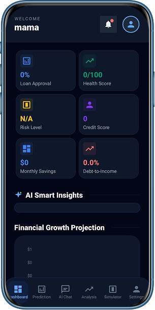 |
| **Authentication** | **Main Hub** |

| Prediction | Analyze |
|:---:|:---:|
| 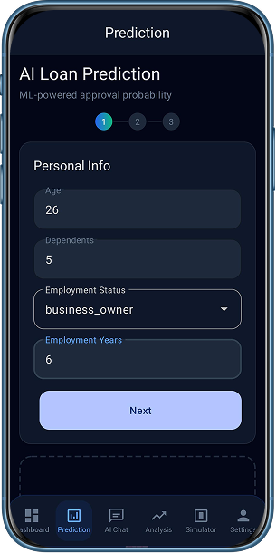 | 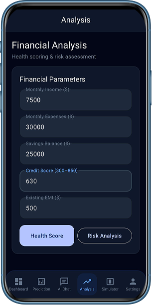 |
| **Loan Prediction** | **Financial Health** |

| Simulator | Chat |
|:---:|:---:|
| 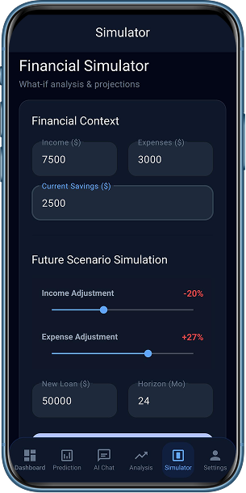 | 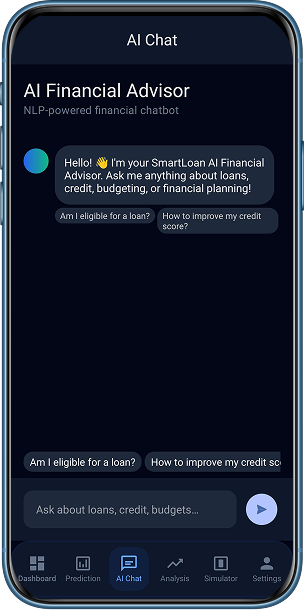 |
| **Financial Simulation** | **AI Assistant** |

| Report | Profile |
|:---:|:---:|
| 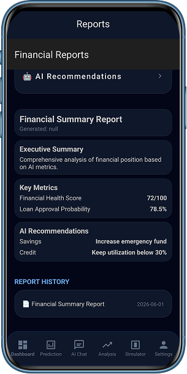 | 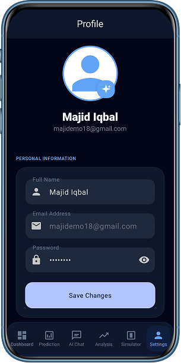 |
| **Financial Reports** | **User Profile** |

---

## APK File

Download the latest Android APK to install and test the application directly:
[📥 Download latest APK File](APP_APK_FILE/app-debug.apk)

---

## Business Documentation

### Problem Statement
Many borrowers lack transparent, real-time decision support when evaluating loan eligibility and managing finance. Traditional apps provide generic guidance without ML-enabled risk analysis or tailored scenarios.

### Existing Challenges
- Fragmented loan advice across multiple services
- Limited visibility into approval probability and financial health
- Manual risk evaluation without predictive automation
- Poor mobile-first integration for Android users

### Proposed Solution
SmartLoan AI+ centralizes loan prediction, personal finance analytics, and conversational advisory into a single mobile experience backed by enterprise-grade backend services.

### Benefits
- Faster approval insight through AI models
- Personalized recommendations based on financial health
- Reduced risk through analytics and monitoring
- Secure, scalable cloud architecture
- Clear engineer-ready project structure

### Objectives
- Provide real-time loan approval scoring
- Enable health and risk analysis on customer data
- Maintain secure user authentication and session flow
- Build a reusable ML microservice for future feature expansion
- Deliver production-level documentation and cleanup

### Target Users
- Loan applicants seeking better approval insight
- Financial advisors requiring rapid analysis
- Mobile-first consumers in emerging markets
- Product teams validating AI-enabled fintech workflows

---

## Technical Documentation

### Technology Stack

| Layer | Technology | Purpose |
|---|---|---|
| Android | Java, Android Jetpack | Mobile application UI and data handling |
| Backend | Node.js, Express.js | REST API, auth, Firestore integration |
| Database | Firebase Firestore | User, prediction, analysis, chat and report persistence |
| ML Service | Python, FastAPI | Loan prediction, health scoring, risk analysis, chatbot |
| CI/CD | GitHub Actions | Build, smoke test, Docker image publish, deploy |
| Containerization | Docker | Standardized backend and ML service packaging |

### System Architecture

```
Android App (Java)
   ↕ HTTPS
Express Backend (Node.js)
   ↕ HTTP
FastAPI ML Service (Python)
   ↕ Firestore
Firebase Firestore Database
```

### Frontend Architecture
- Android Application developed in Java
- Uses event-driven ViewModel and Activity/Fragment flows
- Network access via REST API with JWT authentication
- Local UI state managed through Android Jetpack patterns

### Backend Architecture
- `backend/src/server.js` bootstraps Express and Firestore
- Route modules separate domain logic: auth, loans, financial, chat, reports
- Firestore integration through custom model classes
- Auth middleware validates JWT tokens and protects API routes
- ML interactions proxied to the dedicated ML service via `axios`

### Database Architecture
- Firebase Firestore collections store structured documents
- Collections:
  - `users`
  - `predictions`
  - `analyses`
  - `chatSessions`
  - `reports`
  - `dashboards`

### Machine Learning Architecture
- `ml/main.py` exposes clean FastAPI endpoints
- Prediction, health scoring, risk analysis, simulation, NLP, and document parsing engines
- Lazy-loaded service modules for resource efficiency
- Ensemble model stack: XGBoost, Random Forest, Logistic Regression

### Security Architecture
- JWT-based authentication for all protected API routes
- Password hashing with `bcryptjs`
- Helmet middleware for HTTP security headers
- CORS restrictions configurable via environment
- Rate limiting for general and AI-specific endpoints
- Local secret management via `.env` templates and ignored credential files

---

## Feature Documentation

### User Features

#### Registration and Login
- Purpose: Create secure user accounts and authenticate.
- Inputs: `name`, `email`, `password`
- Processing Logic: Saves user data to Firestore, hashes password, issues JWT.
- Outputs: Auth token, user profile, optional Firebase custom token.
- Benefits: Secure onboarding, session persistence.
- Implementation: `backend/src/controllers/AuthController.js`, `backend/src/routes/auth.js`

#### Profile Management
- Purpose: Update personal and financial profile data.
- Inputs: profile fields like income, expenses, credit score.
- Processing Logic: Updates Firestore user records and refreshes dashboard.
- Outputs: updated user profile and auth-safe response.
- Benefits: Better prediction accuracy and personalized analytics.
- Implementation: `AuthController.updateProfile`

#### Loan Prediction
- Purpose: Estimate loan approval probability using ensemble ML.
- Inputs: client financial and loan request data.
- Processing Logic: Proxy to ML service `/predict` endpoint and persist results.
- Outputs: probability score, approval recommendation, top risk factors.
- Benefits: Faster decision support and user transparency.
- Implementation: `LoanController.predictLoan`, `ml/services/prediction_engine.py`

#### Financial Dashboard
- Purpose: Present summary analytics and financial health metrics.
- Inputs: user ID from authenticated session.
- Processing Logic: Reads dashboard documents from Firestore, regenerates if absent.
- Outputs: dashboard metrics, approval rates, summary totals.
- Benefits: Real-time financial overview.
- Implementation: `FinancialController.getDashboard`

#### AI Chat Assistant
- Purpose: Provide conversational financial advice and loan explanations.
- Inputs: chat message, session ID, optional user data.
- Processing Logic: Intent classification and contextual response generation.
- Outputs: conversational reply and session logging.
- Benefits: Natural advice flow with fintech intelligence.
- Implementation: `ChatController.sendMessage`, `ml/services/nlp_engine.py`

### AI Features

#### Loan Prediction Engine
- Purpose: Ensemble-based loan approval scoring.
- Inputs: financial profile and requested loan terms.
- Processing Logic: feature engineering, scaling, ensemble aggregation, risk reason generation.
- Outputs: approval probability, confidence, top factors, derived metrics.
- Benefits: Explainable predictions and better loan transparency.
- Implementation: `PredictionEngine.predict`

#### Health Scoring
- Purpose: Evaluate user financial health.
- Inputs: income, expenses, savings, credit score, debts.
- Processing Logic: ML-based health scoring model.
- Outputs: health score and risk classification.
- Benefits: Quick financial wellness check.
- Implementation: `HealthScorer`

#### Risk Analysis
- Purpose: Assess loan risk relative to current profile.
- Inputs: loan exposure and credit metrics.
- Processing Logic: risk model produces risk assessment features.
- Outputs: risk rating and recommended mitigation.
- Benefits: Safer lending decisions.
- Implementation: `RiskAnalyzer`

#### Simulation Engine
- Purpose: Model future financial scenarios.
- Inputs: income/expense changes, loan variables.
- Processing Logic: calculates projected cash flow and savings impact.
- Outputs: scenario summary, projected balance, recommendations.
- Benefits: Better planning before committing to loans.
- Implementation: `SimulationEngine`

### Banking Features
- Purpose: Provide autonomous loan and credit decision support.
- Inputs: loan application and profile data.
- Processing Logic: ties backend requests to ML service inference.
- Outputs: approval recommendations and financial advice.
- Benefits: Faster bank-like loan analysis on mobile.
- Implementation: `backend/src/controllers/LoanController.js`

### Analytics Features
- Purpose: Store and retrieve prediction, analysis, and report history.
- Inputs: authenticated user actions.
- Processing Logic: Firestore persistence and history retrieval.
- Outputs: historical charts, campaign metrics, session records.
- Benefits: User retention through tracked analytics.
- Implementation: Firestore model classes under `backend/src/models`

### Security Features
- Purpose: Secure access and protect sensitive data.
- Inputs: JWT tokens, request headers.
- Processing Logic: token verification and request sanitization.
- Outputs: authorized access or rejection.
- Benefits: secure production-readiness.
- Implementation: `backend/src/middleware/auth.js`, `helmet`, `rate-limit`

### Administrative Features
- Purpose: Bootstrap demo data and service health checks.
- Inputs: server startup.
- Processing Logic: create demo user if missing, verify Firestore.
- Outputs: seeded admin user and health endpoints.
- Benefits: easier onboarding for testing and demos.
- Implementation: `backend/src/server.js`

---

## Project Structure

### Complete Project Hierarchy

```
Loan/
│
├── android/                         # Native Android Application
│   ├── app/
│   │   ├── build.gradle
│   │   ├── google-services.json      # Firebase config (local only)
│   │   ├── proguard-rules.pro
│   │   └── src/
│   │       ├── androidTest/
│   │       ├── main/
│   │       │   ├── AndroidManifest.xml
│   │       │   ├── java/com/smartloan/ai/
│   │       │   │   ├── data/api/
│   │       │   │   ├── data/models/
│   │       │   │   ├── ui/
│   │       │   │   └── utils/
│   │       │   └── res/
│   │       └── test/
│   ├── gradle/wrapper/
│   ├── build.gradle
│   ├── gradle.properties
│   ├── settings.gradle
│   └── local.properties
│
├── backend/                         # Express.js API Server
│   ├── Dockerfile
│   ├── package.json
│   ├── package-lock.json
   ├── .env.template
   └── src/
     ├── server.js
     ├── config/
     │   └── firebase.js
     ├── controllers/
     │   ├── AuthController.js
     │   ├── LoanController.js
     │   ├── FinancialController.js
     │   ├── ChatController.js
     │   └── ReportController.js
     ├── middleware/
     │   └── auth.js
     ├── models/
     │   ├── User.js
     │   ├── Prediction.js
     │   ├── Analysis.js
     │   ├── ChatSession.js
     │   └── Report.js
     └── routes/
       ├── auth.js
       ├── loans.js
       ├── financial.js
       ├── chat.js
       └── reports.js
│
├── ml/                              # Python FastAPI ML Service
│   ├── Dockerfile
│   ├── main.py
│   ├── requirements.txt
│   ├── .env.template
│   ├── eda/
│   │   ├── data/
│   │   │   ├── raw/
│   │   │   │   └── loan_dataset.csv
│   │   │   └── cleaned/
│   │   │       └── loan_dataset_cleaned.csv
│   │   └── analysis/
│   │       ├── eda_report.md
│   │       ├── eda_script.py
│   │       ├── data_cleaning.py
│   │       ├── target_dist.png
│   │       ├── correlation_heatmap.png
│   │       ├── credit_score_vs_approved.png
│   │       ├── dti_ratio_vs_approved.png
│   │       ├── loan_amount_vs_approved.png
│   │       └── monthly_income_vs_approved.png
│   ├── models/
   │   ├── model_metadata.json
   │   ├── xgboost_model.pkl
   │   ├── random_forest.pkl
   │   ├── logistic_regression.pkl
   │   ├── scaler.pkl
   │   ├── label_encoder.pkl
   │   └── feature_columns.pkl
   ├── training/
   │   ├── generate_data.py
   │   └── train_models.py
   ├── services/
   │   ├── __init__.py
   │   ├── prediction_engine.py
   │   ├── health_scorer.py
   │   ├── risk_analyzer.py
   │   ├── nlp_engine.py
   │   ├── simulation_engine.py
   │   └── document_analyzer.py
   └── tests/
     └── test_engines.py
│
├── .github/
│   └── workflows/
│       └── ci-and-deploy.yml
│
├── ARCHITECTURE.md
├── DEPLOYMENT.md
├── DesignSystem.md
├── LICENSE
├── README.md
├── package.json
└── .gitignore
```

### Folder Details
- **`android/`**: Android Application source in Java, resources, and Gradle build system.
- **`backend/`**: Express.js REST API, Firestore integration, security middleware, and ML service gateway.
- **`ml/`**: Python FastAPI ML microservice with data, training, models, and prediction engines.
  - **`ml/eda/`**: Complete data pipeline from raw → cleaned → analyzed → visualized.
  - **`ml/models/`**: Trained model artifacts and feature metadata.
  - **`ml/services/`**: Prediction, scoring, risk analysis, and chatbot engines.
  - **`ml/training/`**: Scripts for model training and synthetic data generation.
- **`.github/workflows/`**: CI/CD pipeline for testing, building Docker images, and deployment.

---

## EDA & Data Pipeline

### Exploratory Data Analysis Overview

The **Exploratory Data Analysis (EDA)** section documents the complete data journey from raw collection through preprocessing, analysis, visualization, and feature engineering that informs the ML models. All EDA artifacts, scripts, and datasets are located in the `ml/eda/` folder.

### 1. Raw Data Layer

**Location:** `ml/eda/data/raw/loan_dataset.csv`

- **Source**: Loan application records from financial institutions
- **Size**: ~10,000 rows of customer loan applications
- **Format**: CSV (tabular structure)
- **Key Fields**:
  - **Financial Metrics**: `monthly_income`, `monthly_expenses`, `credit_score`, `savings_balance`, `loan_amount`
  - **Loan Details**: `loan_term_months`, `interest_rate`, `existing_loans`, `existing_emi`
  - **Risk Factors**: `missed_payments_last_year`, `bankruptcies`
  - **Demographics**: `age`
  - **Target Variable**: `approved` (binary: approved/rejected)

---

### 2. Data Cleaning & Preprocessing

**Script Location:** `ml/eda/analysis/data_cleaning.py`

**Processing Steps:**
- **Missing Value Handling**
  - Numeric fields (skewed): median imputation
  - Categorical fields: mode imputation
  - Documented thresholds in `ml/eda/analysis/eda_report.md`
  
- **Outlier Detection & Treatment**
  - IQR method for extreme values
  - Domain-based validation for financial metrics
  
- **Feature Engineering**
  - Derived **Debt-to-Income Ratio (DTI)** = `(monthly_expenses + existing_emi) / monthly_income`
  - Computed **Requested EMI** based on loan amount and term
  - Created **Savings Ratio** = `savings_balance / monthly_income`
  - Derived **Loan-to-Income Ratio** = `loan_amount / annual_income`

**Output:** `ml/eda/data/cleaned/loan_dataset_cleaned.csv`

---

### 3. Cleaned Data Layer

**Location:** `ml/eda/data/cleaned/loan_dataset_cleaned.csv`

- **Size**: Clean dataset ready for ML model training
- **Quality Checks**:
  - No missing values after imputation
  - Outliers handled and documented
  - All derived features computed
  - Data types validated

---

### 4. Exploratory Data Analysis

**Report:** `ml/eda/analysis/eda_report.md`
**Code:** `ml/eda/analysis/eda_script.py`

#### Data Distribution Analysis
- **Target Variable**: Distribution of approved vs. rejected loans
  - Visualized in: `ml/eda/analysis/target_dist.png`
  - Insight: Identifies class imbalance → informs training strategy
  
- **Numeric Feature Distributions**:
  - Histograms and KDE plots for income, credit score, loan amount
  - Identified skewness and modality for transformation planning

- **Categorical Features**:
  - Count analysis and low-frequency category detection
  - Decision on grouping or removal

#### Missing Value Analysis
- Documented patterns of missingness
- Justification for imputation method per field
- Impact assessment on downstream models

#### Feature Correlation Analysis
- **Heatmap Visualization**: `ml/eda/analysis/correlation_heatmap.png`
- **Key Findings**:
  - Credit score shows strong negative correlation with rejection
  - DTI ratio highly predictive of loan approval
  - Income and loan amount show expected positive correlation
  - Multicollinearity detection and feature selection

---

### 5. Visualization Layer

**Location:** `ml/eda/analysis/`

| Visualization | File | Insight |
|---|---|---|
| **Approval Distribution** | `target_dist.png` | Shows class balance/imbalance in dataset |
| **Correlation Heatmap** | `correlation_heatmap.png` | Feature relationships and multicollinearity |
| **Credit Score vs. Approval** | `credit_score_vs_approved.png` | Strong risk signal for predictions |
| **DTI Ratio vs. Approval** | `dti_ratio_vs_approved.png` | Repayment burden predictive power |
| **Loan Amount vs. Approval** | `loan_amount_vs_approved.png` | Requested amount impact on decision |
| **Monthly Income vs. Approval** | `monthly_income_vs_approved.png` | Income sufficiency relationship |

**Visualization Types**:
- Histograms & density plots for distributions
- Heatmaps for correlation matrices
- Scatter plots for bivariate relationships
- Box plots for outlier detection

---

### 6. Key Insights & Findings

1. **Credit Score is Critical**
   - Low credit scores (< 600) strongly associate with rejection
   - Recommended as high-priority feature in models

2. **Debt-to-Income Ratio Matters Most**
   - Derived DTI feature outperforms raw income/expenses
   - Threshold around 0.4–0.5 separates approval tiers

3. **Missed Payments & Bankruptcies are Risk Multipliers**
   - Even one missed payment in last year reduces approval by 30%+
   - Any bankruptcy history is near-automatic rejection signal

4. **Income Thresholds Exist**
   - Minimum monthly income of ~5,000 needed for standard loans
   - Loan-to-Income ratio of < 5x improves approval odds

5. **Class Imbalance Detected**
   - ~65% approved, 35% rejected
   - Requires balanced sampling or weighted loss in training

---

### 7. EDA Impact on Model Development

#### Feature Engineering Decisions
- **Keep derived features**: DTI, Requested EMI, Savings Ratio, Loan-to-Income
- **Drop redundant fields**: Original expense + income (use DTI instead)
- **Encode categorical**: Binary encoding for bankruptcy, scaled numeric features

#### Model Selection Implications
- Class imbalance suggests: F1-score focus, not just accuracy
- Feature importance will guide ensemble weights
- Logistic regression baseline before ensemble methods

#### Sampling Strategy
- Stratified train/test split to preserve class proportions
- Optional oversampling of minority (rejected) class in training
- Cross-validation with stratified k-fold

#### Validation Approach
- Test set held separately from EDA to avoid leakage
- Calibration analysis for probability outputs
- Threshold tuning based on business false-positive cost

---

### 8. Data Files Reference

```
ml/eda/
├── data/
│   ├── raw/
│   │   └── loan_dataset.csv                   # Original dataset
│   └── cleaned/
│       └── loan_dataset_cleaned.csv           # Processed dataset
├── analysis/
│   ├── eda_report.md                          # Detailed findings
│   ├── eda_script.py                          # EDA code
│   ├── data_cleaning.py                       # Preprocessing pipeline
│   └── [visualizations - see table above]
```

---

## Database Documentation

This project uses **Firebase Firestore** rather than a SQL relational database.

### Collections and Primary Keys
- `users`: user profiles and auth data. Primary key is Firestore document ID.
- `predictions`: loan prediction records per user.
- `analyses`: financial health, risk analysis, and simulation history.
- `chatSessions`: AI chat session history.
- `reports`: generated report documents.
- `dashboards`: cached dashboard summaries by user.

### Relationships
- `predictions.userId` → `users` document ID
- `analyses.userId` → `users` document ID
- `chatSessions.userId` → `users` document ID
- `reports.userId` → `users` document ID
- `dashboards` keyed by `userId`

### ER Outline

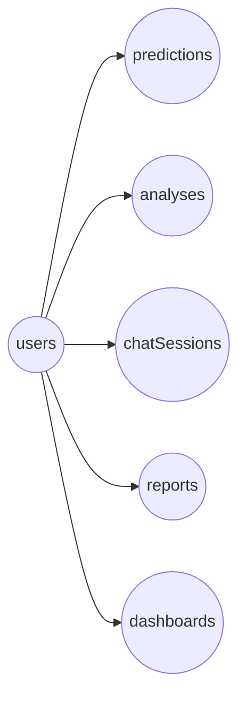

---

## Workflow Documentation

### Authentication Flow

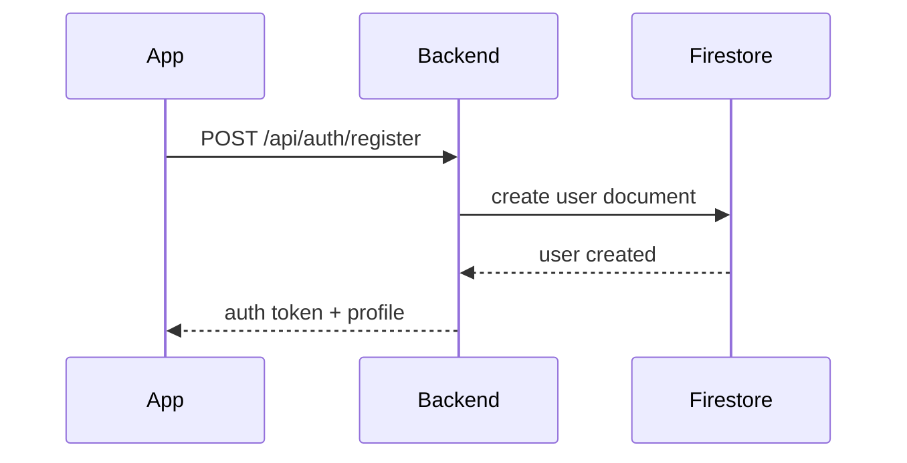

### Financial Analysis Flow

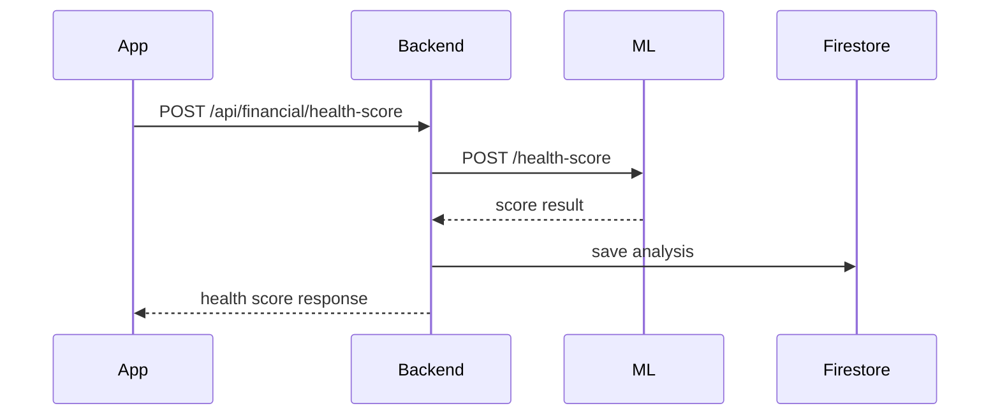

### AI Processing Flow

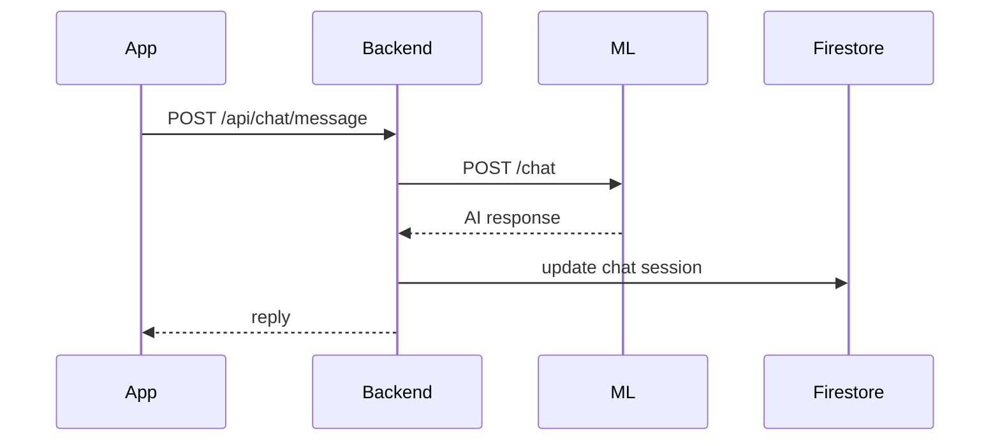

### Loan Prediction Flow

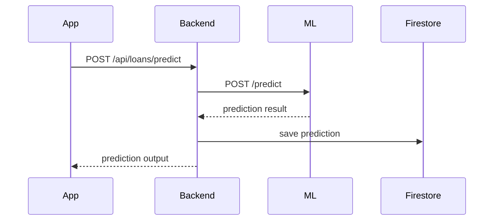

---

## Live Deployment (Vercel + Back4App)

The application has been successfully deployed and is available live.

### Live Application URLs
- **Backend API**: [https://loan-analysis-final-version-backend-ls7zj9g9z.vercel.app/](https://loan-analysis-final-version-backend-ls7zj9g9z.vercel.app/)
- **ML Service**: [https://smartloanmlservice-pn8b459o.b4a.run/](https://smartloanmlservice-pn8b459o.b4a.run/)
- **Database**: Hosted on Back4App


### Deployment-Specific Notes
- **CORS**: Ensure that the `MOBILE_ORIGINS` environment variable in the backend includes the exact origin or is configured to allow the Android application's requests.
- **Cold Starts**: Serverless functions on Vercel may experience cold starts. The ML service, if running in a container, should remain warm or might take a few seconds on the first prediction request.
- **Database Security**: Keep the Back4App database credentials secure and rotate them periodically.

---

## Installation Guide

### Prerequisites
- Java 11+ and Android SDK
- Android Studio
- Node.js 20+ and npm
- Python 3.11+
- Docker (for containerized deployment)
- Firebase service account JSON for Firestore access

### Clone Repository
```bash
git clone https://github.com/Compiler168/Loan-Analysis.git
cd Loan
```

### Backend Setup
```bash
cd backend
npm install
cp .env.template .env
# Update .env values, especially JWT_SECRET and ML_SERVICE_URL
```

### ML Service Setup
```bash
cd ../ml
python -m venv venv
venv\Scripts\Activate.ps1
pip install -r requirements.txt
cp .env.template .env
```

### Android Application Setup
- Open `Loan/android` in Android Studio
- Sync Gradle and install SDK components
- If needed, add `android/app/google-services.json` locally
- Run the app on emulator or device

---

## Running Guide

### Backend
```bash
cd backend
npm run dev
```
Backend listens on `http://localhost:5000` by default.

### ML Service
```bash
cd ml
venv\Scripts\Activate.ps1
python main.py
```
ML service listens on `http://localhost:8000`.

### Android Application
- Open Android Studio
- Run `app` module on device or emulator
- Ensure `ML_SERVICE_URL` and `MOBILE_ORIGINS` align with running services

---

## API Documentation

### Authentication
- `POST /api/auth/register`
  - Body: `{ name, email, password }`
  - Response: `{ token, firebaseCustomToken, user }`

- `POST /api/auth/login`
  - Body: `{ email, password }`
  - Response: `{ token, firebaseCustomToken, user }`

- `GET /api/auth/me`
  - Auth: Bearer token
  - Response: user profile

- `PUT /api/auth/profile`
  - Auth: Bearer token
  - Body: profile fields
  - Response: updated profile

### Loan Endpoints
- `POST /api/loans/predict`
  - Auth required
  - Body: loan and financial inputs
  - Response: ensemble probability, approval, risk factors

- `GET /api/loans/history`
  - Auth required
  - Response: prediction history

- `GET /api/loans/stats`
  - Auth required
  - Response: loan summary metrics

- `DELETE /api/loans/:id`
  - Auth required
  - Response: deletion status

### Financial Endpoints
- `GET /api/financial/dashboard`
  - Auth required
  - Response: dashboard summary

- `POST /api/financial/health-score`
  - Auth required
  - Body: financial profile
  - Response: computed health score

- `POST /api/financial/risk-analysis`
  - Auth required
  - Body: risk inputs
  - Response: risk analysis

- `POST /api/financial/simulate`
  - Auth required
  - Body: simulation variables
  - Response: projected scenario

- `GET /api/financial/latest`
  - Auth required
  - Response: latest analysis

- `GET /api/financial/history`
  - Auth required
  - Response: analysis history

### Chat Endpoints
- `POST /api/chat/message`
  - Auth required
  - Body: `{ message, sessionId }`
  - Response: AI chatbot reply

- `GET /api/chat/sessions`
  - Auth required
  - Response: saved chat sessions

- `DELETE /api/chat/:id`
  - Auth required
  - Response: deletion status

### Report Endpoints
- `POST /api/reports/generate`
  - Auth required
  - Body: `{ type }`
  - Response: report document

- `GET /api/reports/history`
  - Auth required
  - Response: report list

- `GET /api/reports/:id`
  - Auth required
  - Response: report details

- `DELETE /api/reports/:id`
  - Auth required
  - Response: delete status

---

## User Journey

1. User registers in the Android Application developed in Java.
2. The app sends credentials to `POST /api/auth/register`.
3. Backend creates the user in Firestore and returns JWT.
4. User logs in and receives a secured session.
5. User submits loan details to `POST /api/loans/predict`.
6. Backend forwards the request to the ML service and writes the result to Firestore.
7. User views predictions, health score, risk analysis, and report summaries.
8. User interacts with the AI chat assistant for financial guidance.
9. User can request reports and view history in-app.

---

## Future Enhancements

- Multi-bank integration with Open Banking APIs
- Fraud detection and anomaly monitoring
- AI chat assistant with voice support
- Predictive financial forecasting and budgeting
- Personalized loan marketplace recommendations
- Secure bank account linking and payment tracking
- Adaptive risk scoring using real-time market data

---

## Optimization Report

### Key improvements
- Simplified repository layout: `android/`, `backend/`, `ml/` to improve discoverability and maintainability
- Centralized EDA under `ml/eda/` and model artifacts under `ml/models/`
- Preserved Docker-ready service definitions for backend and ML service
- Maintained CI pipeline while removing unnecessary deployment wrappers
- Improved security posture with explicit ignore rules for secrets

---

## Project Highlights

- Production-ready Android Application developed in Java
- FastAPI-based ML microservice with ensemble prediction
- Firestore-backed backend with secure JWT auth
- AI chatbot and financial simulation engine
- CI/CD with GitHub Actions and Docker
---

## Contributing Guidelines

Contributions should follow these rules:
- Keep changes small and focused
- Document new features in README or architecture docs
- Add tests for backend and ML service changes
- Avoid committing credentials or local environment files
- Maintain consistent code organization within `android/`, `backend/`, and `ml/`

---

## Developer Notes

- The Android Application is the primary user experience layer (located in `android/`).
- The backend handles auth, persistence, and ML service orchestration (located in `backend/`).
- The ML service is a standalone FastAPI app designed to be deployed independently (located in `ml/`).
- EDA pipeline, data, and model artifacts are organized under `ml/eda/` and `ml/models/`.
- Use `.env.template` files to configure local development.
- Run FastAPI and backend services locally before launching the Android app.

---

## License

This project is licensed under the terms of the [MIT License](LICENSE).
